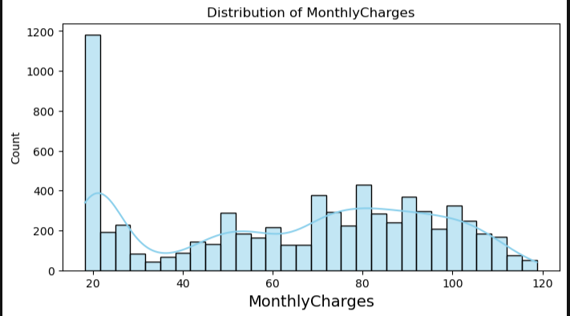
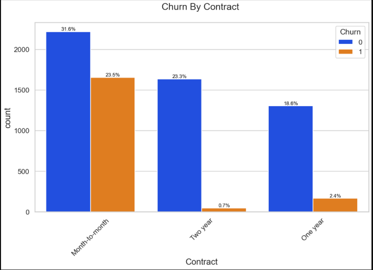
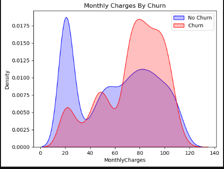
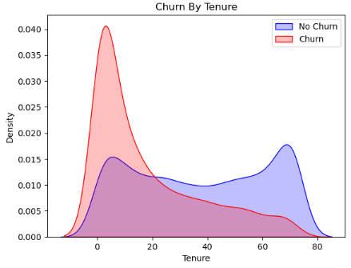
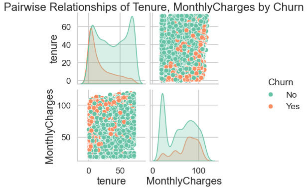
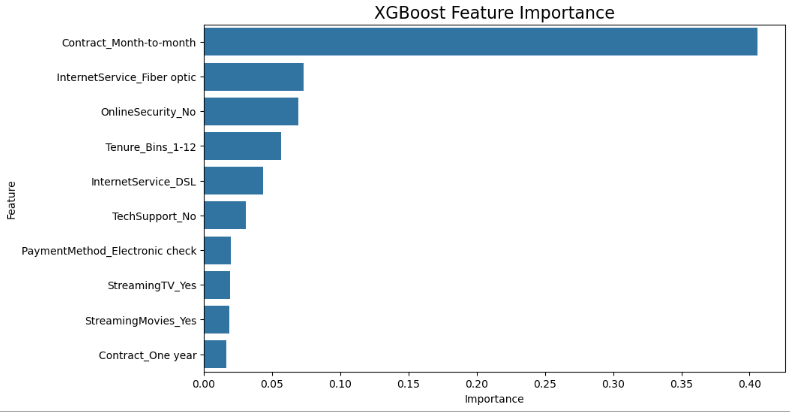

# 🚀 Customer Churn Prediction

---

## **Project Overview**
This project aims to **predict customer churn** for a telecom company using historical customer data.  
By analyzing patterns in customer demographics, subscriptions, and billing, we identify factors that contribute to churn and build a predictive model.

---

## **Dataset**
- **Records:** ~6896 customers  
- **Features:** Monthly Charges, Total Charges, Tenure, Gender, Internet Service, Contract Type, Payment Method, etc.  
- **Target:** `Churn` (1 = customer churned, 0 = retained)  

---

## **Exploratory Data Analysis (EDA)**

### **Univariate Analysis**
- Most customers are **young**; few senior citizens.  
- **Monthly Charges**: slight left skew, most customers pay moderately high bills.  
- **Total Charges**: right-skewed; many low-tenure customers have lower cumulative charges.  
- Customers mostly have **no dependents** and prefer **Fiber Optic Internet**.  
- **Month-to-month contracts** and **Electronic Check payments** are most common.

### **Bivariate Analysis**
- High churn observed for:
  - Month-to-month contracts  
  - No tech support / online backups  
  - Fiber-optic connections  
  - Customers with 1-year tenure  
  - Payment via Electronic Check  
- Low churn observed for long-tenure customers (>5 years) and two-year contracts.  
- Gender, phone services, multiple lines → no significant impact.  

### **Multivariate Analysis**
- Customers with **short tenure and high monthly charges** have higher churn probability.  
- Pairplot shows churned customers concentrated in **low tenure and high charges**.

---

## **Modeling**
Four models were compared:

| Model | CV Mean Accuracy | Test Accuracy | Test ROC-AUC |
|-------|-----------------|---------------|--------------|
| Logistic Regression | 0.7525 | 0.7185 | 0.7367 |
| Decision Tree | 0.7442 | 0.7150 | 0.6447 |
| Random Forest | 0.7790 | 0.7719 | 0.6766 |
| **XGBoost** | 0.7580 | 0.7534 | 0.7306 |

**✅ Final model:** **XGBoost**  
- Handles **class imbalance** automatically (`scale_pos_weight`)  
- Good balance between **accuracy** and **ROC-AUC**  
- Feature importance helps interpret key drivers of churn  

---

